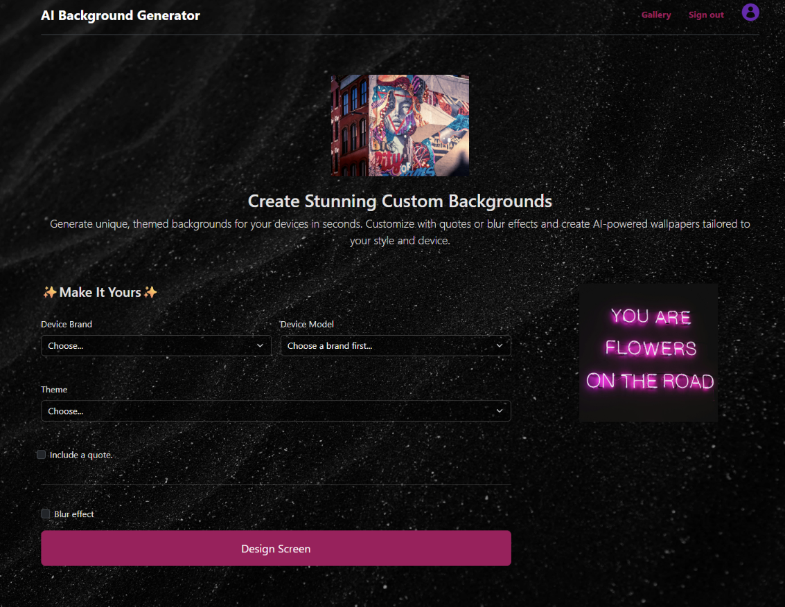
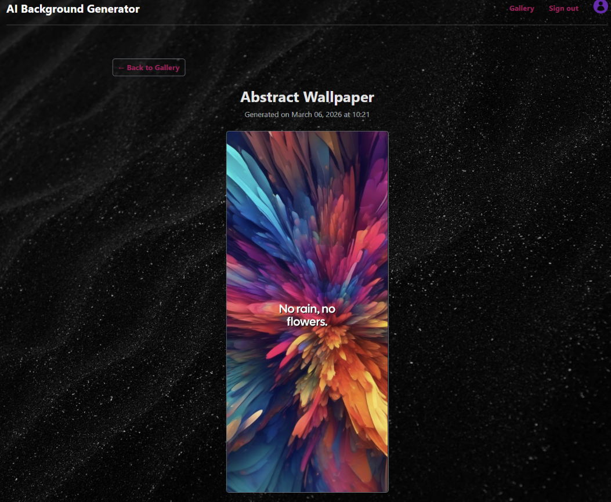
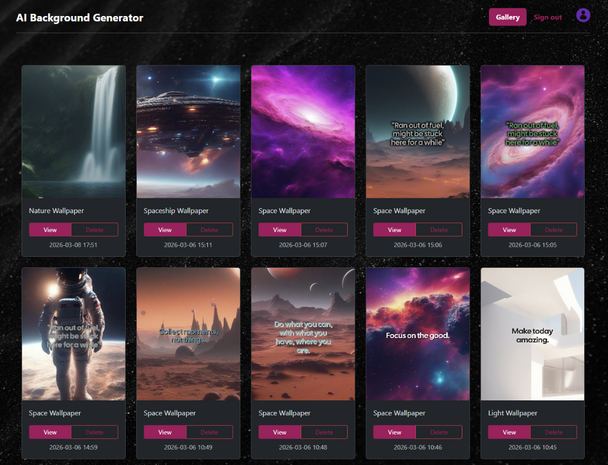

# 🌌 AI Custom Wallpaper Generator

A full-stack web application that allows users to generate high-quality, perfectly sized, AI-powered wallpapers for their specific mobile devices. Built with **Python, Flask, and the Hugging Face Serverless API**.


## 📖 Overview

This project demonstrates a complete, end-to-end web application featuring user authentication, relational database management, third-party API integration, and server-side image manipulation. 

Users can select their exact phone model, choose an aesthetic theme, and let the app generate a stunning, high-resolution background using **Stable Diffusion XL (SDXL)**. The app dynamically crops the generated image to match the device's native resolution and can programmatically overlay motivational quotes with a custom-calculated, readability-enhancing neon glow.

### ✨ Key Features
* **Authentication & User Sessions:** Secure sign-up, log-in, and session handling.
* **Dynamic Resolution Cropping:** Uses a relational database of phone brands and models to crop AI outputs to the exact pixel dimensions of the user's device.
* **Serverless AI Inference:** Integrates the Hugging Face `InferenceClient` to offload heavy image generation to cloud GPUs for rapid rendering.
* **Database-Driven Prompting:** Fetches randomized, highly detailed engineering prompts from the database based on the user's selected theme (e.g., Abstract, Space, Minimal).
* **Smart Image Processing (Pillow):**
  * Optional Gaussian blur filters.
  * Dynamically calculates the average RGB color of the image's center to generate text in the exact **complementary color**.
  * Renders a custom "double-stamp" neon shadow behind text to guarantee readability regardless of the background's complexity or brightness.
* **Personal Gallery:** A user dashboard to view, download, and delete previously generated wallpapers.

---

## 📸 Showcase

> **Note:** Below are examples of the UI and the generated wallpapers.

* 
* 
* 

---

## 🛠️ Tech Stack

* **Backend:** Python, Flask, SQLAlchemy (ORM)
* **Frontend:** HTML5, CSS3, Bootstrap 5, Jinja2 Templating
* **Database:** SQLite (Development) / PostgreSQL (Production ready)
* **AI Engine:** Hugging Face Serverless Inference API (Model: `stabilityai/stable-diffusion-xl-base-1.0`)
* **Image Processing:** Pillow (PIL)

---

## 🚀 How to Run Locally

If you would like to run this project on your local machine, follow these steps:

### 1. Clone the repository
```bash
git clone https://github.com/mirateodora/ai-background-generator
cd ai-wallpaper-generator
```

### 2. Set up a Virtual Environment
```bash
python -m venv venv
source venv/bin/activate  # On Windows use: venv\Scripts\activate
```

### 3. Install Dependencies
```bash
pip install -r requirements.txt
```

### 4. Set Environment Variables
You will need a free Hugging Face account to generate images.
* Create a `.env` file in the root directory.
* Add your API token and Flask Secret Key:

```
FLASK_APP=main.py
FLASK_ENV=development
SECRET_KEY=your_secure_secret_key_here
HF_TOKEN=hf_your_hugging_face_token_here
```

### 5. Initialize the Database
Before running the app, ensure you have populated the database with Device dimensions, Themes, and Quotes.
```bash
flask shell
>>> from database import db
>>> db.create_all()
>>> exit()
```

### 6. Run the Application
```bash
flask run
```

The app will be available at `http://127.0.0.1:5000`.

---

## 👤 Author

**Mira-Teodora Culda**
* GitHub: [@mirateodora](https://github.com/mirateodora/ai-background-generator/commits?author=mirateodora)
* LinkedIn: [Mira-Teodora Culda](www.linkedin.com/in/mira-teodora-culda-b7882026b)